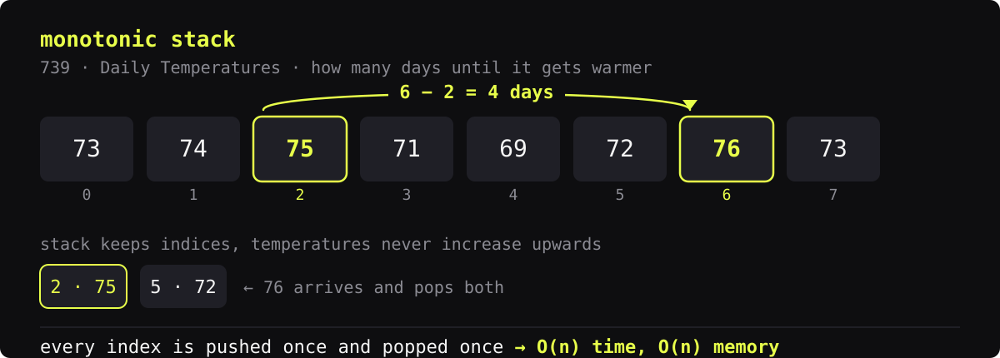

### Stack

| | |
|:--|:--|
| **Core** |    |
| **Web** |   |
| **Data** |     |
| **Ops & QA** |      |
| **Also** |    |

### Method

Problems live in folders by technique, not by number — what solves the same way sits together.

Every solution carries the same header — link to the problem, the idea in two lines, time and memory. [Read this one](https://github.com/letsloose501/algorithms/blob/main/monotonic-stack/0739-daily-temperatures.py)

### Repositories

| | |
|:--|:--|
| **[algorithms](https://github.com/letsloose501/algorithms)** | LeetCode and handbook problems — every solution with the idea behind it and its complexity |
| **[Python](https://github.com/letsloose501/Python)** | Knowledge base: standard library, data model, interpreter internals |
| **[Agent-Skills](https://github.com/letsloose501/Agent-Skills)** | Skills for Claude Code that I use every day |

